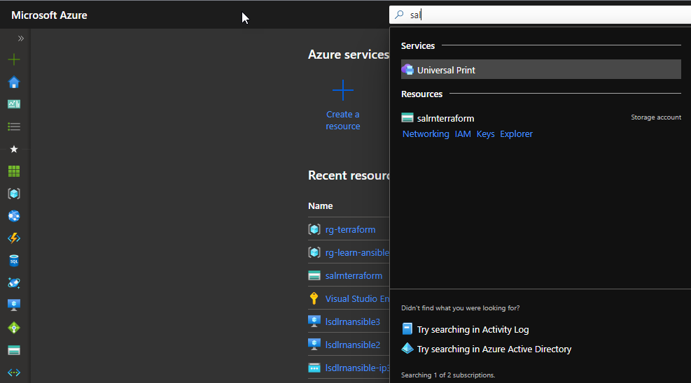
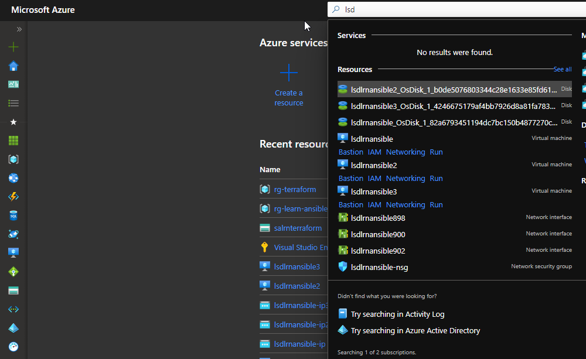

# extension-azure-helper

## Summary

A chrome extension to help with navigating the azure portal.

## Description

Attaches shortcut links below azure resource search results in the top search pane.
Supports:

- Virtual Machines - Attaches links to Bastion, IAM, Networking, Run Commands.
- Storage Accounts - Attaches links to Networking, IAM, Access Keys, Storage Explorer.
- Key Vaults - Attaches links to Networking, IAM, Secrets, Certificates

## Screenshots

- Keyvault search demo   

- Storage account search demo   

- Virtual machine search demo   
